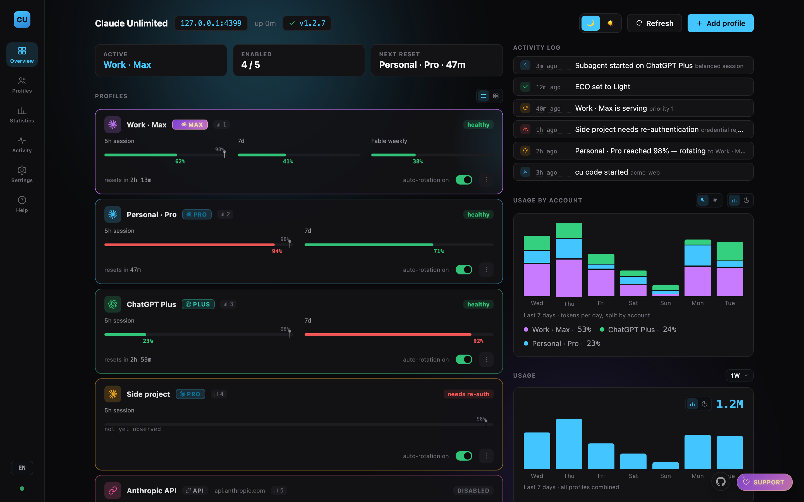
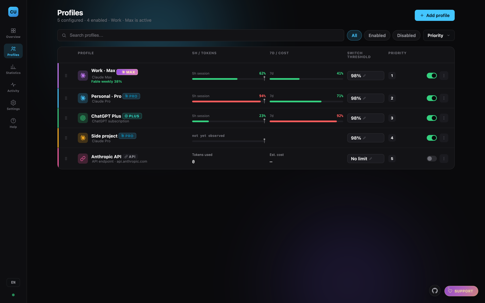
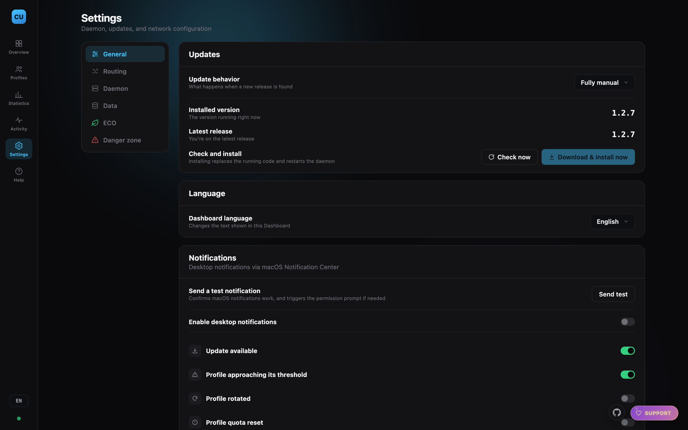

<div align="center">

# Claude Unlimited

### When one account hits its usage limit, your session doesn't.

Claude Unlimited pools your Claude (Pro · Max), ChatGPT/Codex, and Anthropic API accounts
into one continuous supply for Claude Code. When an account runs dry, the next one takes
over on the very next request — same session, same context, same terminal. You keep typing.

*This is a fork of [DevDock-AI/claude-unlimited](https://github.com/DevDock-AI/claude-unlimited)
carrying configurable launch commands, a configurable listen port, and a WSL install path.*

<br>

<table>
<tr>
<td align="center" width="150"><br><b>Claude</b><br><sub>Pro · Max</sub></td>
<td align="center" width="150"><br><b>ChatGPT</b><br><sub>Codex · Plus · Pro</sub></td>
<td align="center" width="150">🔑<br><b>API keys</b><br><sub>Anthropic · gateways</sub></td>
<td align="center" width="60"><b>→</b></td>
<td align="center" width="260"><b>one Claude Code session</b><br><sub>that never stops</sub></td>
</tr>
</table>

### **You never notice the switch.**

It happens **between requests**, in the background. No logout, no handover, no restarting
the session — the account underneath you changes and nothing else does. Often the
dashboard's activity log is the only place you'll find out it happened.

[](LICENSE)
[](https://github.com/Mabuti/claude-unlimited/actions/workflows/ci.yml)


[](https://ko-fi.com/devdock)

<br>



</div>

---

## Contents

| | |
|---|---|
| **[Why Claude Unlimited](#why-claude-unlimited)** | The problem it removes |
| **[Features](#features)** | What you get |
| **[How it works](#how-it-works)** | The flow, and why nothing leaves your machine |
| **[Install](#install)** | One line |
| **[Installing under WSL](#installing-under-wsl)** | Read this first if that's you |
| **[ Add a Claude subscription](#add-a-claude-subscription)** | One command |
| **[ Add a ChatGPT / Codex subscription](#add-a-chatgpt--codex-subscription)** | One command |
| **[Add an API key](#add-an-api-key)** | Dashboard only |
| **[Models parity](#which-gpt-model-runs-your-claude-model)** | Which GPT model runs each Claude model |
| **[Usage](#usage)** | Daily driving |
| **[The Claude desktop app](#using-the-claude-desktop-app)** | Route the app through your pool too |
| **[The dashboard](#the-dashboard)** | What you can see and control |
| **[Notifications](#notifications)** | Know before you run out |
| **[Updates](#updates)** | How new versions reach you |
| **[Command reference](#command-reference)** | Every command |
| **[AGENTS.md](AGENTS.md)** | Setting this up with a coding agent |
| **[Troubleshooting](#troubleshooting)** · **[Security](#security)** · **[Contributing](#contributing)** | The rest |

---

## Why Claude Unlimited

You're deep in a Claude Code session. Context is loaded, the plan is working — and you hit
your usage limit.

The manual workaround is grim: write yourself a handover note, log out, log into another
account, paste the note back, and hope nothing important got lost.

**Claude Unlimited removes that moment entirely.** When one account approaches its limit,
the next one takes over on the very next request. Same session, same context, same
terminal. You don't get logged out, you don't get prompted, you don't restart anything.
Often the first you'll know about it is a line in the activity log.

It pools whatever you've got — Claude Pro/Max subscriptions, ChatGPT/Codex subscriptions,
Anthropic API keys, your own gateway — and treats them as one continuous supply.

> Other multi-account tools automate the swap too, but they're CLI-only. There's nowhere
> to *see* what's happening. Claude Unlimited's control surface is a real dashboard.

---

## Features

|  | |
|---|---|
| 🔄 | **Seamless rotation** — the handover happens between requests. Your session never breaks, never prompts, never restarts. |
|  | **Mixed pools** — Claude subscriptions, ChatGPT/Codex, and API keys side by side, each with its own priority and threshold. |
|  | **Claude Code, powered by GPT** — a Codex account is translated to and from the Anthropic API shape, with real token-level streaming. Claude Code can't tell. |
| 🎚️ | **[Models parity](#which-gpt-model-runs-your-claude-model)** — you decide which GPT model and reasoning effort each Claude model maps to, and what it costs your Codex quota. |
| 🖥️ | **[The Claude desktop app too](#using-the-claude-desktop-app)** — not just the terminal. One command points it at your pool, and `--revert` puts it back. |
| 📊 | **A dashboard you'll actually open** — live usage bars, cost tracking, model split, per-project attribution, activity log. |
| 🔒 | **100% local** — no account, no telemetry, no cloud. Your credentials never leave your machine. |
| ⚙️ | **One command to work** — `claude-unlimited code` and you're routed. |
| 🔔 | **Notifications** — told before you run out, not after. |
| 🔑 | **OS-native credential storage** — Keychain / Secret Service / DPAPI. Never plaintext on disk. |
| 📦 | **Encrypted export/import** — move your whole setup to another machine safely. |
| 🌍 | **4 languages** — English, Spanish, Romanian, German. |
| 🪶 | **Almost no dependencies** — Python standard library, one library for export encryption, zero frontend build. |

---

## How it works

```
   claude  (or any Anthropic-API client)
      │
      │   ANTHROPIC_BASE_URL=http://127.0.0.1:4317
      ▼
╔═══════════════════════════════════════════════╗
║   Claude Unlimited daemon — YOUR MACHINE      ║   127.0.0.1 only.
║                                               ║   Not reachable from
║   ┌─────────────────────────────────────┐     ║   your network, let
║   │  Router — picks the account         │     ║   alone the internet.
║   │  sticky until it hits its threshold │     ║
║   └──────────────────┬──────────────────┘     ║
║   ┌──────────────────▼──────────────────┐     ║
║   │  Gateway — swaps in the real        │     ║
║   │  credential for this one request    │     ║
║   └──────────────────┬──────────────────┘     ║
║   ┌──────────────────▼──────────────────┐     ║
║   │  Dashboard  ·  127.0.0.1:4317       │     ║
║   └─────────────────────────────────────┘     ║
╚═══════════════════┬═══════════════════════════╝
                    │  only the request you already meant to make
                    ▼
     api.anthropic.com   ·   ChatGPT/Codex   ·   your own gateway
```

<table>
<tr><td>

**The rotation is invisible to Claude Code.** It sends one request, gets one answer. It is
never told which account served it, never asked to re-authenticate, and never sees a
different endpoint.  Claude,  ChatGPT/Codex and 🔑 API keys all
arrive as the same Anthropic-shaped response — which is exactly why your session can carry
on through a switch without noticing one happened.

</td></tr>
</table>

### Nothing leaves your computer

This is the part worth being explicit about:

- **No account. No sign-up. No cloud component.** There is no Claude Unlimited server. It
  cannot phone home, because there is no home.
- **No telemetry, ever.** Usage stats, cost estimates, the activity log, project
  attribution — all of it is written to files in your home directory and read by a
  dashboard served from `127.0.0.1`. None of it is transmitted anywhere.
- **Your credentials never move.** They live in your OS keystore (macOS Keychain, Linux
  Secret Service, Windows DPAPI), never in plaintext on disk, and are attached to a
  request only at the moment it goes to **the provider you configured** — Anthropic,
  OpenAI, or your own gateway.
- **`claude` never sees your real credentials either.** It authenticates to the daemon
  with a local placeholder token. The real credential is substituted server-side and never
  returned to the client.
- **Almost the only outbound traffic is the API call you already intended to make** —
  same destination as without this tool. No quota probing, no keep-warm pings, no
  background chatter. The two exceptions are both ones you can name: a once-a-day
  version check against GitHub's public API, and refreshing an account's own OAuth
  token shortly before it expires, so an account you haven't used in a while doesn't
  quietly need a re-login.

---

## Install

Pick your system, copy the **one line**, paste, done. It installs everything it needs
(even Python, if you don't have it), starts in the background, and opens the dashboard at
**http://127.0.0.1:4317/** — where you add your first account.

**🍎 macOS & 🐧 Linux** — paste into a terminal:

```bash
curl -fsSL https://raw.githubusercontent.com/Mabuti/claude-unlimited/main/install.sh | bash
```

**Under WSL?** Read [Installing under WSL](#installing-under-wsl) instead of pasting that —
it's the same install, with three things WSL doesn't give you handled in order.

**🪟 Windows** — press **Win + R** (or open **Command Prompt**), paste, press Enter:

```bat
powershell -ExecutionPolicy Bypass -NoProfile -Command "irm https://raw.githubusercontent.com/Mabuti/claude-unlimited/main/install.ps1 | iex"
```

**🪟 Windows, already in PowerShell?** — paste this shorter version instead:

```powershell
irm https://raw.githubusercontent.com/Mabuti/claude-unlimited/main/install.ps1 | iex
```

Then run `claude-unlimited code` and you're routed. On Windows, run the installer from an
**Administrator** PowerShell if you also want it to start automatically at logon;
credentials are stored with Windows DPAPI instead of the Keychain.

> **Which platform is this best on?** Claude Unlimited is developed and tested on
> **macOS**, so that's the most battle-hardened path. **Windows and Linux are best-effort:**
> every OS-specific piece (credential storage, the background service, the installer) is
> implemented and covered by tests, and it *should* work fine — but it hasn't had the same
> real-world mileage, so treat it as "should be fine, not guaranteed." If anything's off,
> please [open an issue](https://github.com/Mabuti/claude-unlimited/issues).

Don't want it starting on login? Turn it off in **Settings → Daemon**, or run
`claude-unlimited uninstall`. It keeps running either way until you stop it.

> **Using an AI agent to set this up?** Point it at
> [`AGENTS.md`](AGENTS.md) — it spells out the install, what's safe, and the
> one step an agent must hand back to you (the browser login).

<details>
<summary>What that command does, and how to install from a clone instead</summary>

<br>

The installer creates an isolated environment at `~/.local/share/claude-unlimited/`,
links `claude-unlimited` into `~/.local/bin`, runs `claude-unlimited doctor`, and
registers the daemon as a login service (`launchd` / `systemd --user` / Task Scheduler).
It touches nothing else, and tells you if `~/.local/bin` isn't on your `PATH`.

If the service can't be registered it falls back to running for this session only, and
says so rather than pretending it succeeded.

Prefer to read it first, or install from a checkout?

```bash
git clone https://github.com/Mabuti/claude-unlimited.git
cd claude-unlimited
./install.sh
```

Requires **Python 3.10+**, **git**, and the **`claude`** CLI on your `PATH`.

</details>

### Installing under WSL

Under WSL, systemd is off by default, nothing unlocks the login keyring at sign-in, and
`add-account` may not be able to open a browser. The install is the same; these steps
handle those three, in the order they have to happen. Commands are for Ubuntu/Debian.

**Before you start.** Inside WSL:

```bash
sudo apt update && sudo apt install python3 python3-venv git gnome-keyring libsecret-tools
export PATH="$HOME/.local/bin:$PATH"   # the installer's own check needs this on a fresh distro
```

plus the `claude` CLI on your PATH inside WSL — and `codex`, if you'll pool Codex accounts.

**1. Check systemd is on.** The background service is a `systemd --user` unit. Recent
Ubuntu WSL images ship `/etc/wsl.conf` with it already enabled; check, and add this if
it's missing (needs `sudo`):

```ini
[boot]
systemd=true
```

If you had to add it, `wsl --shutdown` from a Windows prompt and reopen. Without it the
installer still runs, but only for that terminal session, and says so.

**2. Install from a checkout**, not the one-liner, so that updating is a `git pull` away:

```bash
git clone https://github.com/Mabuti/claude-unlimited.git
cd claude-unlimited
./install.sh
```

If the output says **Install failed** — typically *Failed to connect to user scope bus* —
stop there, even though the installer carries on to its normal closing lines. That means
the service wasn't registered and step 3 has nothing to attach to. Check
`systemctl --user is-system-running`, fix step 1 if it isn't `running`, then
`claude-unlimited install` before going on.

The dashboard usually won't open by itself under WSL (no `xdg-open` on a stock distro) —
open the printed URL in a Windows browser. And read `doctor`'s "Secret store: OK" narrowly: it means the
backend imports, not that a keyring is running. Step 3 is still required.

**3. Make the keyring unlock itself.** Credentials live in the Linux Secret Service, and
after every reboot the login keyring comes up locked — which looks like every account
being exhausted (see [Troubleshooting](#troubleshooting)). Follow
[`docs/linux-keyring.md`](docs/linux-keyring.md) end to end: it creates the keyring on
first run, installs the unlock script, the unit that runs it before the daemon, and the
drop-in that re-checks on every daemon start, and shows how to test it short of a reboot.
It needs the daemon installed first, which is why it comes after step 2.

**4. Add your accounts.** `add-account` and `add-codex-account` say they open your
browser; under WSL it may not. If nothing opens, copy the URL the login command prints
into a Windows browser and finish there — `add-account` then asks for the authorization
code in the terminal.

If a "Choose password for new keyring" dialog (or similar) appears when you run
`add-account`, cancel it and go back to step 3 — the keyring doesn't exist yet, and a
password typed into that dialog is one nothing can supply at boot. After your next
reboot, every account will look exhausted (see [Troubleshooting](#troubleshooting)).

**Updating:** From a checkout, `git pull` then `./install.sh` again —
`claude-unlimited restart` on its own only restarts the code that's already installed.
Or let the in-app updater handle it under **Settings → Updates**, which replaces
`~/.local/share/claude-unlimited/app` instead. Read [Updates](#updates) before touching
that setting.

---

## Add a Claude subscription

 **Claude Pro or Max**

```bash
claude-unlimited add-account
```

Opens your browser, logs into the account, and adds it. That's it — no account IDs to find
or paste.

It logs in through an **isolated session**, so whatever is already signed into `claude` on
your machine is never touched. Run it again for each additional account.

---

## Add a ChatGPT / Codex subscription

 **ChatGPT Plus, Pro, or Business — used through Codex**

```bash
claude-unlimited add-codex-account
```

Same flow, for a ChatGPT/Codex account. Once added, it joins the same rotation — Claude
Code keeps speaking the Anthropic API, and requests routed to this account are translated
to and from OpenAI's transparently, streaming included.

Also isolated: your existing `codex` login is left alone.

### Which GPT model runs your Claude model

Claude Code asks for a Claude model. When the request lands on a Codex account, something
has to decide which GPT model actually answers — and how hard it thinks. That's the
**parity list** in **Settings → Models parity**, and it's yours to edit:

| Claude model | Claude effort | Runs as (Codex) | Codex effort |
|---|---|---|---|
| Claude Fable 5.1 | Automatic | `gpt-6-astra` | high |
| Claude Opus 5 | Automatic | `gpt-5.6-terra` | high |
| Claude Sonnet 5 | Automatic | `gpt-5.6-terra` | medium |
| Claude Haiku 4.5 | Automatic | `gpt-5.6-luna` | low |

- **It's an editable list.** It starts with those four. Add a row with **+ Add model**,
  remove one with the red 🗑, and **Save**. **Reset to defaults** brings the four back.
- **The list is your model picker.** Whatever you save is exactly what `/model` offers in a
  Codex-served `cu code` session — nothing more, nothing less. Restart the session to pick
  up changes (the picker is read once at launch).
- **Both sides have an effort dial.** *Codex effort* governs a request served by a Codex
  account; *Claude effort* is applied when a Claude account serves it (`output_config.effort`
  — leave it **Automatic** to keep Claude Code's own choice). Haiku-class and older Sonnet
  models don't accept it, so it's simply ignored there.
- **Dropdowns list the priciest/most-capable first**, drawn live from the model catalogue.
- **Names and prices are live.** The lineup comes from the model catalogue refreshed at each
  session launch, so `gpt-6-astra` / Fable 5.1 show up without a release.

**Effort is the expensive dial, not model size.** A Codex plan's quota is spent on
reasoning tokens produced, multiplied by the model's tier — not on how much context you
send. Turning a row up to `high` costs noticeably more of your weekly allowance than
leaving it at `medium`; resending a long conversation costs nothing extra. That's
measured behaviour, not a guess — see
[`docs/adr/0007-codex-quota-is-driven-by-reasoning-not-context.md`](docs/adr/0007-codex-quota-is-driven-by-reasoning-not-context.md).

The list applies to Codex profiles left on **Automatic**. A profile with its own model
override keeps using that instead, so you can pin one account to a specific model and let
the rest follow the list.

> **Picker limitation:** Claude Code's `/model` picker can relabel at most its four standard
> tiers (Fable, Opus, Sonnet, Haiku). Extra rows you add are still served and usable by id
> (`/model <id>` or `--model <id>`), but may not appear in the picker itself.

The Opus, Sonnet and Fable slots in that picker default to their **1M-context** ids, so a
`cu code` session opens with the wider window already selected — no separate flag or `/model`
switch needed. The standard 200k model is still one pick away: it's Claude Code's own entry,
`/model claude-opus-5` (or `claude-sonnet-5` / `claude-fable-5-1`) instead of the default —
the bare tier aliases (`/model opus`) resolve to the 1M slot. Haiku has no
1M variant, so its slot is unchanged. One caveat: the 1M window is a Claude Code/Anthropic
feature — when a Codex account actually serves a given request, it's the GPT model's own
context window that applies instead, and a session that has grown past that window errors
rather than compacting. If a session genuinely needs the full 1M window, pin it to a Claude
profile (`cu code --profile <name>`) rather than leaving it on rotation.

---

## Add an API key

🔑 **Anthropic API keys and Anthropic-compatible gateways**

API keys are added **in the dashboard**, not the CLI — open
**http://127.0.0.1:4317/** → **Add profile**.

That's deliberate. Anything with a form (base URL, auth mode, default model, budget cap,
token threshold) belongs somewhere you can see and edit it, not behind flags you have to
remember. The same goes for everything else about an account: priority, thresholds,
enabling, disabling, and removal are all dashboard-managed.

Works with Anthropic API keys and any Anthropic-compatible gateway.

---

## Usage

### Start working

```bash
claude-unlimited code
```

Starts the daemon if it isn't running and launches `claude` routed through your pool. With
more than one account it asks which to use — or pick **Rotated accounts** to let it manage
itself.

> **Tip:** `cu` is a shorthand for `claude-unlimited` — every command works under both names
> (`cu code`, `cu status`, `cu doctor`, …). An existing install gains `cu` after an update.

```bash
claude-unlimited code --profile "Personal Max"   # pin this session to one account
claude-unlimited code --model opus               # any extra args pass through to claude
```

The dashboard URL stays in Claude Code's status line while you work.

### What rotation actually does

1. Requests go to the enabled account with the **lowest priority number**.
2. It stays on that account — *sticky* — until it crosses its **switch threshold**
   (default 98%) or hits a real quota limit.
3. The next account takes over **on the next request**. Your session continues
   uninterrupted; nothing is lost and nothing is restarted.
4. When a quota window resets, that account rejoins the rotation automatically.

A brief rate-limit blip never causes a switch — only a real threshold crossing or genuine
exhaustion does.

### Using the Claude desktop app

The desktop app can send its inference through your pool too, not just the
terminal:

```bash
claude-unlimited desktop
```

It creates an inference profile named **Claude Unlimited** in the app, points it
at the local daemon, makes it active, and starts the app. Any inference profiles
you already have are left alone.

> **This restarts the Claude desktop app.** If it is running, the command asks
> it to quit, waits for it to close, and reopens it afterwards. **Save anything
> you are working on first.** The app rewrites its own settings as it exits, so
> it has to be fully stopped before its configuration can be changed — a
> half-quit app would overwrite the new settings on its way out. If it will not
> quit (a dialog, unsaved work), the command stops and changes nothing rather
> than writing settings that are about to be clobbered.

**Undoing it.** Everything the command changes is backed up before the first
write, and:

```bash
claude-unlimited desktop --revert
```

restores it. Quit the app before reverting too, for the same reason. The
inference profile named *Claude Unlimited* stays in the app's list — remove it
there if you no longer want it.

Three things worth knowing:

- The app calls this **third-party inference mode**, and it runs from a separate
  app profile with its own session — so you may be asked to sign in again. Your
  normal Claude setup is unaffected.
- The app's **own chat still talks to claude.ai** and is not routed through the
  pool. Only Claude Code sessions inside the app are.
- **Enable at least one account first.** Otherwise the app's "Test connection"
  fails with *No eligible Profile available*, which looks like a configuration
  error but isn't.

This is the only command that writes outside `~/.claude-unlimited/` and
`~/.local/share/claude-unlimited/`; it touches
`~/Library/Application Support/Claude*`, and only when you run it. macOS only
for now. The Help page in the dashboard also documents the manual route, if you
would rather set it up in the app yourself.

### Your project setup is untouched

`claude-unlimited code` runs the same `claude` binary in the same directory. Your
`CLAUDE.md`, `.claude/` settings, skills, subagents, memory, and session history all
behave exactly as they normally do. The only thing that changes is which account serves
the request.

Your project's `.claude/settings.json` is used as-is — permissions, allow lists, hooks,
everything. The one exception is its `env` block: if it pins `ANTHROPIC_BASE_URL` or
`ANTHROPIC_AUTH_TOKEN`, Claude Code applies that **on top of** the routing set up for you,
and every request would go to whatever that file names, with whatever credential it
carries, never reaching your pool. Those two keys are reasserted for the session, and it
says so when it happens. Nothing else in `env` is touched, and no file is modified.

> One other difference: because the daemon authenticates you with its own local token,
> claude.ai-hosted connectors are disabled for that session. Locally-configured MCP
> servers are unaffected.

---

## The dashboard

**http://127.0.0.1:4317/** — everything is managed here.

<div align="center">

<br><em>Profiles — drag to reorder priority, edit thresholds inline, enable or disable in one click</em>
</div>

<br>

- **Overview** — account cards (roomy list or compact cells), live usage and cost, model
  breakdown, per-project attribution, recent activity.
- **Profiles** — the full table: search, filter, sort, drag to reorder priority, and a
  menu to edit, test, disable, or remove.
- **Activity** — every rotation, session, and config change, filterable and exportable.
- **Settings** — updates, [models parity](#which-gpt-model-runs-your-claude-model),
  auto-start, process controls, the launch command for each CLI, the listen port,
  notifications, export/import, language.
- **Help** — every CLI command, explained.

Numbers update live, without refreshing. Usage bars shift amber then red as an account
nears its threshold, so you see it coming.

Every view has its own URL — `/profiles`, `/activity`, `/settings`, `/help` — so you can
bookmark one, reload without losing your place, and use the browser's back button.

<details>
<summary>More screenshots — activity log, settings, help, light theme</summary>
<br>

<br><br>

<br><br>

<br><br>

</details>

---

## Notifications

Desktop notifications tell you what's happening without watching the dashboard:

| Notification | Tells you |
|---|---|
| **Approaching threshold** | An account is close to switching — before it does |
| **Rotated** | Which account just took over |
| **Quota reset** | An account is available again |
| **Needs attention** | Something needs you: re-auth, or no eligible account left |
| **Update available** | A new version has been released, downloaded, or installed |

Turn them on per category in **Settings → Notifications**, and use **Send test
notification** there to confirm they reach you.

> **Not seeing any?** Check two things. First, **Settings → Notifications** — each
> category has its own switch, and *Rotated* and *Quota reset* are **off by default**, so
> the two most frequent events are silent until you enable them. Second, your OS: on macOS
> your terminal needs permission under **System Settings → Notifications**, or they're
> delivered silently and you never see them.

---

## Updates

> **On this fork:** the updater points at this repository (Mabuti/claude-unlimited),
> never upstream. Releases are cut here — see
> [`docs/RELEASING.md`](docs/RELEASING.md). The default mode, *Auto-download only*,
> stages a verified copy but never installs without a click — **Fully manual** is a
> preference, not a safety fix. If you installed from a checkout (`./install.sh` after
> cloning), you can keep updating that way — `git pull` then `./install.sh` — or let the
> in-app updater take over instead; an in-app install replaces
> `~/.local/share/claude-unlimited/app`, so pick one path, not both.

Claude Unlimited checks for new releases on its own and does exactly what you
tell it to in **Settings → Updates**:

| Mode | What happens when a release is found |
|---|---|
| **Fully manual** | You're told. Nothing is downloaded. |
| **Auto-download only** | Downloaded and verified, then waits for you to click install. |
| **Auto-download + install** | Downloaded, verified, and installed. Restart to finish. |

How a download is trusted, since this installs code on your machine:

1. The release source is **hardcoded** — nothing in your config can point the
   updater at a different repository.
2. Every request is HTTPS with certificate verification; a non-HTTPS redirect
   is refused.
3. The GitHub API names the commit a release's tag points at. The updater
   clones that tag and **refuses to install unless the commit it actually got
   is that same commit**. Git objects are content-addressed, so altered
   contents cannot produce the expected hash.
4. Your previous installation is kept. If the new version can't even be
   imported, it's **rolled back automatically** — a bad release leaves you on
   the version that worked.

This proves the code came from this repository's history as GitHub reports it.
It is not a signature check: it can't prove GitHub itself, or an account with
push access, is honest. That's a deliberate, documented limit.

## Command reference

Every command is daemon lifecycle or account authentication. **Everything else — accounts,
thresholds, priority, budget caps, export/import, launch commands, the listen port — lives
in the dashboard.** The same list
is in the dashboard under **Help**.

Every command below also works under the short alias **`cu`** — e.g. `cu code`, `cu status`.

<details open>
<summary><b>Getting started</b></summary>

<br>

| Command | What it's for |
|---|---|
| `claude-unlimited doctor` | Checks your install, credential storage, and config. Run it first, and whenever something seems off. |
| `claude-unlimited add-account` | Adds a Claude subscription via browser login. Isolated — never disturbs your existing `claude` login. |
| `claude-unlimited add-codex-account` | Same, for a ChatGPT/Codex subscription. |
| `claude-unlimited reauth` | Re-authenticates an account that needs it. Logs back into the *same* account, never a new one. |

</details>

<details open>
<summary><b>Everyday use</b></summary>

<br>

| Command | What it's for |
|---|---|
| `claude-unlimited code` | **The one you'll use.** Launches `claude` routed through your pool — or whatever **Settings → Launch commands** has in its place. Also repairs the `cu` shortcut if an update dropped it. |
| `claude-unlimited code --profile <name>` | Pin the session to one account instead of rotating. |
| `claude-unlimited desktop` | Route the Claude **desktop app** through your pool, then launch it. `--revert` undoes it. |
| `claude-unlimited status` | Is the daemon installed and running, and its pid. |
| `claude-unlimited start` | Run the daemon in this terminal (Ctrl-C to stop). `--port` overrides for this run only; otherwise `CLAUDE_UNLIMITED_PORT` if set, then the port saved in Settings. |

</details>

<details>
<summary><b>Background service</b></summary>

<br>

Auto-start on login — the same thing **Settings → Daemon** controls.

| Command | What it's for |
|---|---|
| `claude-unlimited install` | Start automatically on login (`launchd` / `systemd --user` / Task Scheduler), and start now. |
| `claude-unlimited uninstall` | Stop starting on login. |
| `claude-unlimited service-start` | Start the background daemon now. |
| `claude-unlimited service-stop` | Stop it. |
| `claude-unlimited restart` | Stop and start the daemon, service-managed or not. Needed after an update replaces the code, since a running process keeps serving the version it started with. |

</details>

<details>
<summary><b>Removing it</b></summary>

<br>

| Command | What it's for |
|---|---|
| `claude-unlimited purge` | Removes everything: stored credentials, config, usage history, the app and its virtualenv, the CLI symlink, and the service registration. If the Claude desktop app was routed through the pool, its own settings are restored first. Asks for confirmation first, unless you pass `--yes`. `~/.claude` is never touched. |

Credentials are deleted from your OS keystore *before* the config goes, since
the config is the only record of which Profiles exist.

</details>

---

## Troubleshooting

<details>
<summary><b>An account says "needs re-auth"</b></summary>
<br>

Usually it fixes itself — tokens are refreshed in the background whether or not an account
is currently in rotation. If it doesn't, run `claude-unlimited reauth`: it lists whichever
accounts actually need it, so there's no guessing.
</details>

<details>
<summary><b><code>claude-unlimited: command not found</code></b></summary>
<br>

`~/.local/bin` isn't on your `PATH`:

```bash
export PATH="$HOME/.local/bin:$PATH"
```
</details>

<details>
<summary><b>The dashboard won't load</b></summary>
<br>

```bash
claude-unlimited status
claude-unlimited doctor
```

If it's installed but stopped: `claude-unlimited service-start`. Logs are in
`~/.claude-unlimited/logs/`.
</details>

<details>
<summary><b>Rotation isn't happening</b></summary>
<br>

Check the next account is **enabled**, not already exhausted, and has a higher priority
number than the current one. The activity log records every rotation and every reason one
was skipped.
</details>

<details>
<summary><b>Port 4317 is taken</b></summary>
<br>

Save the port you want as the setting, then install with no flag so the service reads it.
The dashboard won't "change" to the port it's already on, so start it on a scratch port
for this one step:

```bash
claude-unlimited start --port 4401        # scratch port; dashboard at http://127.0.0.1:4401/
#   → Settings → Port → 4400 → Apply
#   Ctrl-C
claude-unlimited install                  # no flag: reads the saved port
```

You'll see either *Saved — applies the next time the daemon starts* (no service registered
yet) or *Moving the dashboard to port 4400* (a service was already registered and has just
been rewritten). Ctrl-C the scratch daemon either way; `install` is then harmless.

Or skip the dashboard: put `{"settings": {"port": 4400}}` in `~/.claude-unlimited/config.json`
— create the file if it doesn't exist, merge into `settings` if it does — and run
`claude-unlimited install`.

Every later command resolves to the saved port, unless `CLAUDE_UNLIMITED_PORT` is set,
which wins. `--port` on its own is for that one run and isn't remembered. Once the service
is installed, **Settings → Port** does the restart and the unit rewrite for you.
</details>

<details>
<summary><b>After a reboot, every request fails "exhausted" and <code>cu reauth</code> says nothing needs re-auth (Linux / WSL)</b></summary>
<br>

On Linux and WSL the usual cause is that the login keyring is locked and nothing unlocked
it at sign-in, so the daemon can't read its tokens. It treats that as the accounts cooling
down, not as an auth problem — which is why `reauth` finds nothing to do. Fix:
[`docs/linux-keyring.md`](docs/linux-keyring.md). Stop the daemon before restarting the
keyring, or it can come back locked again.
</details>

---

## Where your data lives

| What | Where |
|---|---|
| Credentials | macOS Keychain / Linux Secret Service / Windows DPAPI — never plaintext on disk |
| Account configuration | `~/.claude-unlimited/config.json` |
| Usage history | `~/.claude-unlimited/usage_history.jsonl` (capped at 20,000 events) |
| Project attribution | `~/.claude-unlimited/project_usage.json` |
| Logs | `~/.claude-unlimited/logs/` |
| Your Claude Code setup | `~/.claude` — untouched |

## Security

- Binds to `127.0.0.1` only, and refuses to bind anywhere else.
- `claude` authenticates with a local placeholder token, never your real credentials.
- The dashboard API is CSRF-protected with a strict Content-Security-Policy.
- Nothing local is ever transmitted anywhere except the provider you configured.

Full threat model and vulnerability reporting: [`SECURITY.md`](SECURITY.md).

## Requirements

- **macOS, Linux, or Windows** — macOS is verified on real hardware upstream; this fork
  runs day-to-day under **WSL (Ubuntu)**. Other Linux desktops and Windows are a real but
  less-exercised path
  ([details](docs/adr/0005-windows-linux-backends-unverified-first-cut.md)).
- **Python 3.10+** (with `venv`), **git**, and the **`claude`** CLI — plus **`codex`** if
  you'll pool Codex accounts.
- On Linux: **`libsecret-tools`** and a running Secret Service provider. Under WSL that means
  **`gnome-keyring`** plus the unlock unit from [`docs/linux-keyring.md`](docs/linux-keyring.md).

## A note on Terms of Service

Claude Unlimited automates something you could do by hand: switching to another of your
own accounts when one runs low. It uses only credentials you configure, runs entirely on
your machine, and is fully open source.

Anthropic hasn't explicitly endorsed automated multi-account rotation. This project
deliberately avoids what would make that worse — no quota probing, no keep-warm traffic,
nothing that acts without a real request from you. Use your own judgment about your own
accounts' terms.

## Development

```bash
python3 -m pip install -e ".[dev]"
python3 -m pytest tests/
```

`pytest` is the only extra the `dev` install adds — the daemon itself still
needs nothing but the standard library and `cryptography`.

No frontend build step — `claude_unlimited/static/` is plain HTML/CSS/JS.
See [`docs/ARCHITECTURE.md`](docs/ARCHITECTURE.md) for the module map, and
[`CONTRIBUTING.md`](CONTRIBUTING.md) for the ground rules.

Adding a language is one file: copy `claude_unlimited/locales/en.json` and translate it.

## Roadmap

- **Signed releases** — the updater verifies that a downloaded release matches the commit
  GitHub names for its tag, which proves the code came from this repository's history. A
  detached signature would additionally prove authorship; not implemented yet.
- **Real-hardware verification on Linux and Windows** — the code exists and is unit-tested,
  but needs someone running it for real. [`CONTRIBUTING.md`](CONTRIBUTING.md#os-support-status)
  has what to check.

## Contributing

See [`CONTRIBUTING.md`](CONTRIBUTING.md). Keep the backend dependency-free, keep OS-specific
code behind the existing interfaces, and keep account management in the dashboard.

Bug reports and PRs welcome — especially from Linux and Windows users.

## License

[MIT](LICENSE) — do whatever you'd like with it.

<div align="center">
<br>
If this saves you a session, <a href="https://ko-fi.com/devdock">buy me a coffee</a> ☕
</div>
